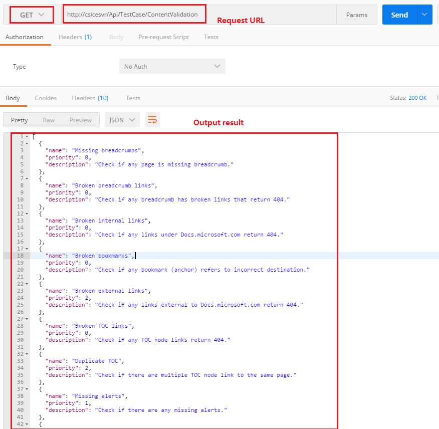

# CATS API for triggering run
In this article
* [Contacts](#contacts)
* [Overview](#overview)
* [Functional Requirements](#requirement)
* [Call Web Service via UI tool or code](#usage)

##  Contacts
|Role |Name; Alias|
|-----|-----|
|Program Manager|Ke Xu (kexu@microsoft.com)|
|Quality|cpebystest@microsoft.com;|

##  Overview
### Goals
Triggering CATS run via call CATS API

###  API
* **Input parameters**: runname, createdBy, testCases and testUrls
* **Output**: RunId in CATS
* **Request URL**: http://csicesvr/Api/ContentValidation/CreateRun_ForOPS
* **HttpMethod**: Post

##  Usage
### Via PostMan call CAPS API
Pre-requisites:
	Get Postman installed
	- If you have not add PostMan App to Chrome. You need to add it to Chrome first.  Step as below:
		1. Open PostMan website: https://www.getpostman.com/
		2. click "Chrome" button, then click "ADD TO CHROME" on the top right corner of pop window.
		3. Launch PostMan App. 
	- If the PostMan App had added to Chrome, you just need to launch it. Below is the step.
		1. Launch Chrome, open a new tab
		2. Click the Chrome App icon on the TOP left corner, if there are no Chrome App icon, if not you need to enable it first. 
		3. Click PostMan, the PostMan App will be launched.

1. Launch [PostMan](https://www.getpostman.com/) from Chrome (Open blank page in chrome, click Apps in the upper left corner then click PostMan)
[!Note] 
>  Neet to call via chrome PostMan app. CATS API does not support call web service via Windows PostMan app, it will return 401.2 - Unauthorized error message
 
2. Enter request URL mentioned in [API](#api) part. Select *HttpMethod* as **Post**
3. Click **Body**, select **raw** and **JSON(application/json)**
4. In request body, input request body with **JSON** format. 
    * Request body (The CATS test cases list refer to [Get CATS test case list](#get-cats-test-cases-list))
     
<table>
<thead>
<th>Request body format</th>
<th>example</th>
</thead>
<tbody>
<tr>
<td>
<pre> 
{
    "runName":"{your run name}",
    "createdBy":"{your alias}",
    "testCases": ["CATS test Case1", "CATS test Case2", …],
    "testUrls":["URL1", "URL2"]
}
</pre>
</td>
<td>
<pre>
{
    "runName":"testOps",
    "createdBy":"FAREAST\\v-yulwa",
    "testCases": ["Missing breadcrumbs"],
    "testUrls":["https://docs.microsoft.com/en-us/", "https://docs.microsoft.com/en-us/windows/"]
}
</pre>
</td>
</tr>    
</tbody>
</table>

5. Click **Send**, the output is Runid in CATS, Go back to CATS, you could check results of this run
    

###  Get CATS test case list
1. Launch PostMan from Chrome
2. Enter request URL: http://csicesvr/Api/TestCase/ContentValidation 
3. Select `HttpMethod` as **Get**
4. Click **Send**, the output is the CATS test case list.
    
